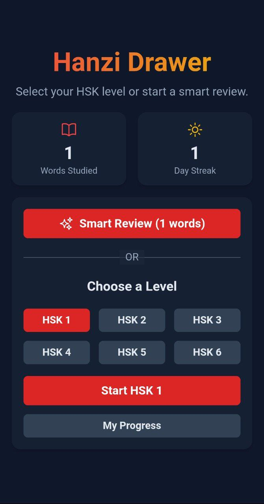
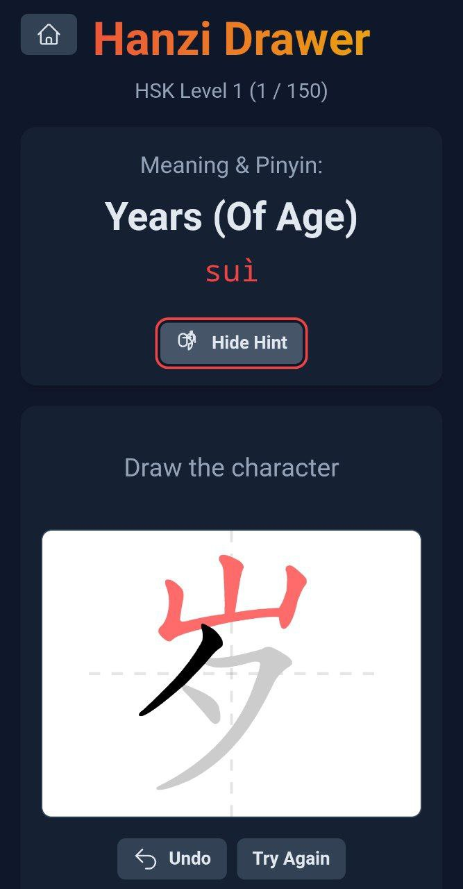

# Hanzi-Drawer
 Hanzi Drawer
A mobile-first app for practicing Chinese character (hanzi) writing with real-time stroke feedback. Covers HSK 1-6 vocabulary (1200+ words). Draw on canvas, get instant corrections for order, direction, shape, and more. Track progress with stats and smart review.

## Screenshots

<table>
<tr>
<td></td>
<td></td>
</tr>
</table>

 Features
- **Interactive Drawing**: Stroke-by-stroke feedback using HanziWriter library.
- **Levels**: HSK 1-6 or "Smart Review" (prioritizes weak words).
- **Stats Dashboard**: Words studied, streak, per-word accuracy/attempts.
- **Offline**: LocalStorage persistence.
- **Mobile-Ready**: Capacitor for Android/iOS builds.
- **Dark Mode**: Tailwind CSS themes.
 Tech Stack
- **Frontend**: React 18 + TypeScript + Vite + Tailwind CSS
- **Drawing**: HanziWriter.js
- **Mobile**: Capacitor
- **Storage**: LocalStorage
 Quick Start
# Install dependencies
npm install
# Development (web)
npm run dev
# Build & Android
npm run build
npx cap sync android
npx cap open android
#Building for Release
npm run build
npx cap sync
cd android
./gradlew assembleRelease  # Generates app-release.aab

